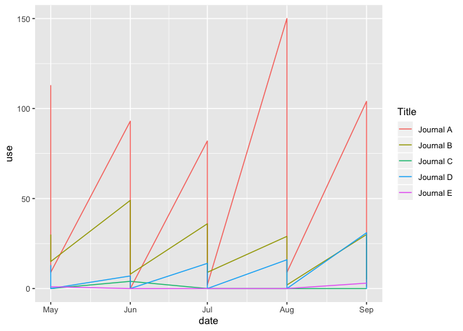
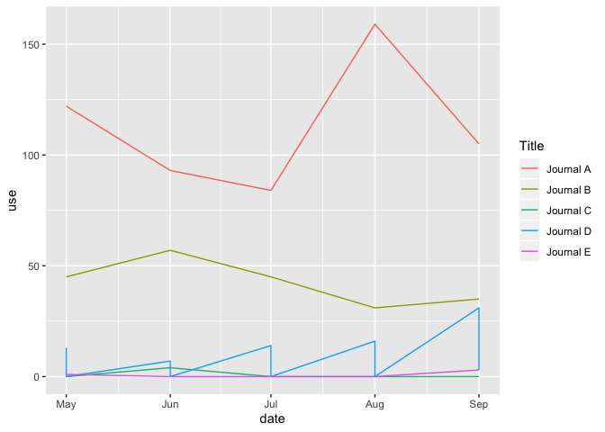
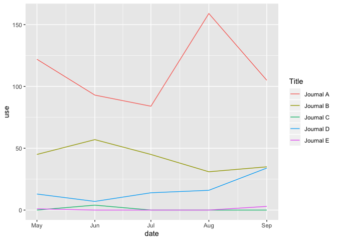
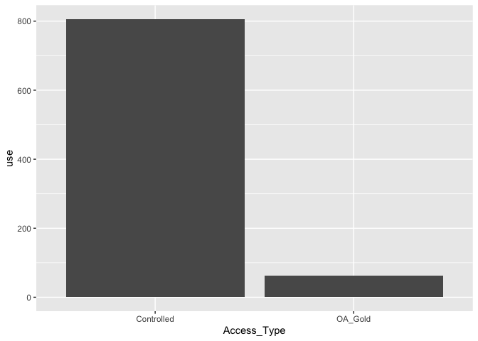
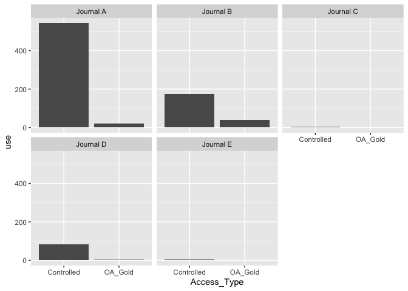
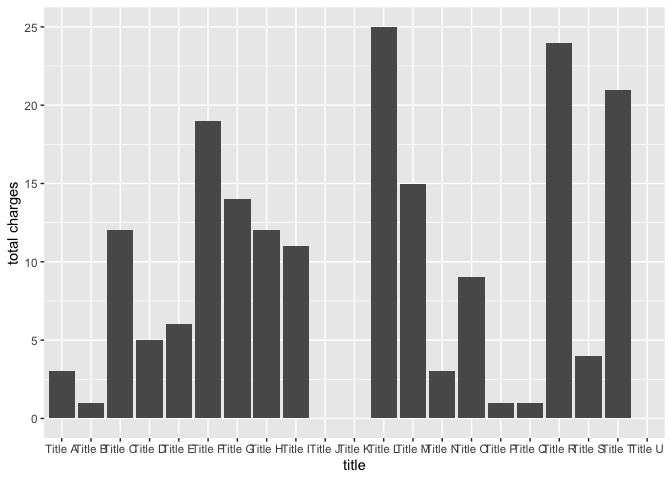
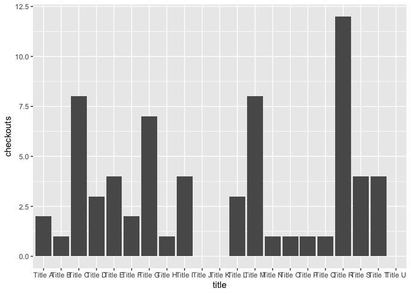
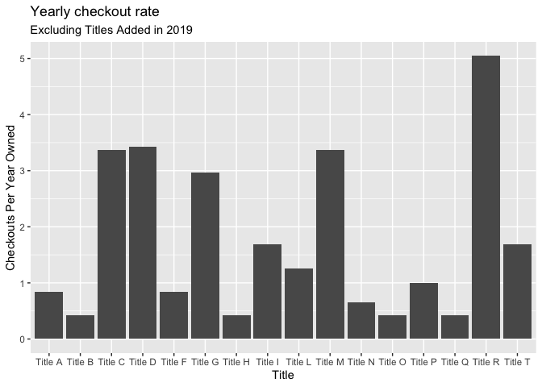

R Markdown example
================

## Librarians Buidling Momentum for Reproducibility 2020

Heidi Tebbe, Collections & Research Librarian for Engineering and Data
Science

Danica Lewis, Collections & Research Librarian for Life Sciences

## Setup

This file was built using an [R Markdown](http://rmarkdown.rstudio.com)
template, which can be exported to a number of different file formats,
including GitHub markdown. When you execute code and display graphs
within the output, the results will appear beneath the code.

This file walks through a demo analysis of some common collections data
tasks.

First you’ll need to download all of the associated workshop files, and
store them on your computer’s Desktop. To be able to load the data
files, we’ll need to be able to tell your computer where they’re stored,
and we do that by setting a working directory.

``` r
setwd("~/Desktop/Charleston")
```

It’s also good to keep a list of the packages you use in this script up
near that top, that way when you try to run it again you can double
check that they are all installed and correctly
    loaded.

``` r
require(tidyverse)
```

    ## Loading required package: tidyverse

    ## ── Attaching packages ─────────────────────────────────────────────────────────────────── tidyverse 1.2.1 ──

    ## ✔ ggplot2 3.2.1     ✔ purrr   0.3.2
    ## ✔ tibble  2.1.3     ✔ dplyr   0.8.3
    ## ✔ tidyr   1.0.0     ✔ stringr 1.4.0
    ## ✔ readr   1.3.1     ✔ forcats 0.4.0

    ## ── Conflicts ────────────────────────────────────────────────────────────────────── tidyverse_conflicts() ──
    ## ✖ dplyr::filter() masks stats::filter()
    ## ✖ dplyr::lag()    masks stats::lag()

``` r
require(dplyr)
require(readxl)
```

    ## Loading required package: readxl

``` r
require(lubridate)
```

    ## Loading required package: lubridate

    ## 
    ## Attaching package: 'lubridate'

    ## The following object is masked from 'package:base':
    ## 
    ##     date

I like to use the require() function to do this, because it will give
you a warning instead of an error if a package doesn’t exist and needs
to be installed.

If you do need to install a package, you can use the install.packages()
function. In this notebook I’ve turned those commands into comments,
just so RStudio doesn’t try to install duplicate copies and get
confused. If you need to run an installation, just remove the \#s.

``` r
#install.packages("tidyverse")
# install.packages("dplyr")
# install.packages("readxl")
# install.packages("lubridate")
```

Once we’ve set our working directory and have the right packages ready
to go, we can start loading, cleaning, and visualizing our data\!

# Journal COUNTER Data

### Read in the COUNTER data and save it to a dataframe called “counter”

Since it’s an excel sheet, the read\_excel() function from the readxl
package is going to be the best function to read in our data. It has a
lot of extra features that help you deal with special excel challenges,
like workbooks with multiple sheets. We only have one sheet and by
default read\_excel() will load the first sheet, but we left that
argument in so you can see where you would specify which sheet you want
to load.

Additionally, COUNTER has a lot of metadata at the top of the sheet,
which is great for keeping track of when the data was collected and for
what, but gets in the way of doing an analysis. We’re going to skip
those first 12 rows and get right to the
data\!

``` r
counter <- read_excel("data_activity_counter_data.xlsx", sheet = 1, skip = 12)
```

### Format the counter dataframe so that it is “tidy” data

The Tidyverse is a series of packages designed for data science by
Hadley Wickham. They’re really useful, but they assume that your data is
“tidy.” One of the biggest challenges of working with collections data
is that it is frequently not tidy, and before you can begin any analysis
you have to reformat it.

Typically, data from vendors or COUNTER reports are “wide” data. The
date variable is usually stored as a column header, with the number of
uses as the values.

``` r
show(counter)
```

    ## # A tibble: 10 x 10
    ##    Title Access_Type   YOP Section_Type Reporting_Perio… `43586` `43617`
    ##    <chr> <chr>       <dbl> <chr>                   <dbl>   <dbl>   <dbl>
    ##  1 Jour… Controlled   2019 Article                   542     113      93
    ##  2 Jour… OA_Gold      2019 Article                    21       9       0
    ##  3 Jour… Controlled   2019 Article                   174      30      49
    ##  4 Jour… OA_Gold      2019 Article                    39      15       8
    ##  5 Jour… Controlled   2019 Article                     4       0       4
    ##  6 Jour… Controlled   2019 Article                    81      13       7
    ##  7 Jour… OA_Gold      2019 Article                     0       0       0
    ##  8 Jour… Controlled   2020 Article                     1       0       0
    ##  9 Jour… OA_Gold      2020 Article                     2       0       0
    ## 10 Jour… Controlled   2019 Article                     4       1       0
    ## # … with 3 more variables: `43647` <dbl>, `43678` <dbl>, `43709` <dbl>

There’s a lot going on here and it’s not super good.

The column headers after Reporting\_Period\_Total are dates, but because
excel realized they were dates and gave them strange custom formatting,
they’re importing as nonsense. We’re going to have to address this in a
moment, but more pressing is the fact that this data isn’t tidy.

Our variables are Title, Access\_Type, YOP, Section\_Type,
Reporting\_Period\_Total, Date, and Use. But Date and Use don’t show up
as columns, they’re stored as headers and values. So our first step will
have to be to gather our wide data into a long data format.

We’ll do this with the gather() function, saving a new version of the
counter dataframe that is long instead of wide. If you wanted to keep
your original wide counter data, possibly for later or as a backup while
you experiment, you could just create a new dataframe called something
like counterLong instead of saving over your dataframe. Inside the
gather function, we say what dataframe we want to use, what the key
column should be called, what the values should be called, and what
columns we want to be affected - which here is all the columns but the
first five.

``` r
counter <- gather(counter, date, use, -c(1:5))
show(counter)
```

    ## # A tibble: 50 x 7
    ##    Title    Access_Type   YOP Section_Type Reporting_Period_To… date    use
    ##    <chr>    <chr>       <dbl> <chr>                       <dbl> <chr> <dbl>
    ##  1 Journal… Controlled   2019 Article                       542 43586   113
    ##  2 Journal… OA_Gold      2019 Article                        21 43586     9
    ##  3 Journal… Controlled   2019 Article                       174 43586    30
    ##  4 Journal… OA_Gold      2019 Article                        39 43586    15
    ##  5 Journal… Controlled   2019 Article                         4 43586     0
    ##  6 Journal… Controlled   2019 Article                        81 43586    13
    ##  7 Journal… OA_Gold      2019 Article                         0 43586     0
    ##  8 Journal… Controlled   2020 Article                         1 43586     0
    ##  9 Journal… OA_Gold      2020 Article                         2 43586     0
    ## 10 Journal… Controlled   2019 Article                         4 43586     1
    ## # … with 40 more rows

Now our data is long, with 50 observations instead of 10. But now each
observation is for a specific title on a specific date, measuring our
variables Title, Access\_Type, YOP, Section\_Type,
Reporting\_Period\_Total, Date, and Use. This didn’t really make
intuitive sense to me at the start, but it makes a lot of sense to the
tidyverse.

Finally we can adress the problems excel caused with our dates. The
easiest solution we’ve found for this is to convert the date column to
numeric values (right now R’s storing them as characters because it has
no clue what on earth excel is going on about) and then converting those
numeric values to date values. We will also have to clarify the start
date, which for excel is 1899-12-30.

``` r
counter$date <- as.numeric(counter$date)
counter$date <- as.Date(counter$date, origin = "1899-12-30")
glimpse(counter)
```

    ## Observations: 50
    ## Variables: 7
    ## $ Title                  <chr> "Journal A", "Journal A", "Journal B", "J…
    ## $ Access_Type            <chr> "Controlled", "OA_Gold", "Controlled", "O…
    ## $ YOP                    <dbl> 2019, 2019, 2019, 2019, 2019, 2019, 2019,…
    ## $ Section_Type           <chr> "Article", "Article", "Article", "Article…
    ## $ Reporting_Period_Total <dbl> 542, 21, 174, 39, 4, 81, 0, 1, 2, 4, 542,…
    ## $ date                   <date> 2019-05-01, 2019-05-01, 2019-05-01, 2019…
    ## $ use                    <dbl> 113, 9, 30, 15, 0, 13, 0, 0, 0, 1, 93, 0,…

The function glimpse() is from the tidyverse as well, and will give you
a nice overview of what’s going on behind the scenes with your
dataframe, including what data type each column is stored as. As we can
see above, date is finally formatted and stored as a date that makes
more sense.

Our Title variable is still stored as a character, and we’ll want to
group observations of the same title together, so one more quick
conversion and then we’ll be off to the races\!

``` r
counter$Title <- as.factor(counter$Title)
```

### COUNTER data exploratory visualization

In our example scenario where we’re looking at data coming out of a
short trial of a new package, probably one of the first things we should
look at is the number of uses each title is getting.

``` r
ggplot(counter, aes(x = date, y = use, color = Title))+
  geom_line()
```

<!-- -->

This does not look like the line graph we were expecting to get, and
it’s because there’s still some underlying mess in our data that we
didn’t notice and therefore haven’t cleaned up. Our variable
“Access\_Type” means that for each month each title has *two* data
points, which creates the jagged lines. So now we actually need to
*spread* our data, and turn Controlled use and OA\_Gold use into their
own columns. At this point Reporting\_Period\_Total is just going to get
in the way and mess everything up, so I’m getting rid of if first by
subsetting the data. I can always calculate it if I want it down the
line.

``` r
counter <- counter[-5]
counter <- spread(counter, Access_Type, use)
show(counter)
```

    ## # A tibble: 30 x 6
    ##    Title       YOP Section_Type date       Controlled OA_Gold
    ##    <fct>     <dbl> <chr>        <date>          <dbl>   <dbl>
    ##  1 Journal A  2019 Article      2019-05-01        113       9
    ##  2 Journal A  2019 Article      2019-06-01         93       0
    ##  3 Journal A  2019 Article      2019-07-01         82       2
    ##  4 Journal A  2019 Article      2019-08-01        150       9
    ##  5 Journal A  2019 Article      2019-09-01        104       1
    ##  6 Journal B  2019 Article      2019-05-01         30      15
    ##  7 Journal B  2019 Article      2019-06-01         49       8
    ##  8 Journal B  2019 Article      2019-07-01         36       9
    ##  9 Journal B  2019 Article      2019-08-01         29       2
    ## 10 Journal B  2019 Article      2019-09-01         30       5
    ## # … with 20 more rows

Now I’ll create a total use column by adding the Controlled and OA\_Gold
columns together, because I don’t feel too fussy right now about where
the use comess
from.

``` r
counter$use <- rowSums(cbind(counter$Controlled, counter$OA_Gold), na.rm = TRUE)
show(counter)
```

    ## # A tibble: 30 x 7
    ##    Title       YOP Section_Type date       Controlled OA_Gold   use
    ##    <fct>     <dbl> <chr>        <date>          <dbl>   <dbl> <dbl>
    ##  1 Journal A  2019 Article      2019-05-01        113       9   122
    ##  2 Journal A  2019 Article      2019-06-01         93       0    93
    ##  3 Journal A  2019 Article      2019-07-01         82       2    84
    ##  4 Journal A  2019 Article      2019-08-01        150       9   159
    ##  5 Journal A  2019 Article      2019-09-01        104       1   105
    ##  6 Journal B  2019 Article      2019-05-01         30      15    45
    ##  7 Journal B  2019 Article      2019-06-01         49       8    57
    ##  8 Journal B  2019 Article      2019-07-01         36       9    45
    ##  9 Journal B  2019 Article      2019-08-01         29       2    31
    ## 10 Journal B  2019 Article      2019-09-01         30       5    35
    ## # … with 20 more rows

And the graph:

``` r
ggplot(counter, aes(x = date, y = use, color = Title))+
  geom_line()
```

<!-- -->

That fixed some of it, but Journal D is still misbehaving. Upon review
our “YOP” variable is also duplicating things by separating out uses to
content published in 2019 and content published in 2020. It would seem
that, for Journal D, the future is now. For now I don’t care about the
year of publication, so I’m going to combine use for 2019 and 2020
content and focus just on total use. I’ll get two more columns I don’t
care so much about, and add the rows that were for 2020 use to the 2019
use rows using aggregate().

``` r
counter <- counter[-c(2:3)]
counter <- aggregate(counter[c(3:5)], by=counter[c(1:2)], sum)
```

Now our graph should come out correctly\!

``` r
ggplot(counter, aes(date, use, color = Title))+
  geom_line()
```

<!-- -->

But what if we *do* care about the access type? I might feel pretty dumb
for deleting and merging that column. But\! I never touched the original
file. So I’ll just copy paste my code to the point where I started doing
things I now regret and start from there. If I were feeling responsible
I would maybe name the dataframe something different this time.

``` r
counterA <- read_excel("data_activity_counter_data.xlsx", skip = 12)

#reformat the counter dataframe
counterA <- gather(counterA, date, use, -c(1:5))
counterA$date <- as.numeric(counterA$date)
counterA$date <- as.Date(counterA$date, origin = "1899-12-30")
counterA$Title <- as.factor(counterA$Title)
show(counterA)
```

    ## # A tibble: 50 x 7
    ##    Title  Access_Type   YOP Section_Type Reporting_Period… date         use
    ##    <fct>  <chr>       <dbl> <chr>                    <dbl> <date>     <dbl>
    ##  1 Journ… Controlled   2019 Article                    542 2019-05-01   113
    ##  2 Journ… OA_Gold      2019 Article                     21 2019-05-01     9
    ##  3 Journ… Controlled   2019 Article                    174 2019-05-01    30
    ##  4 Journ… OA_Gold      2019 Article                     39 2019-05-01    15
    ##  5 Journ… Controlled   2019 Article                      4 2019-05-01     0
    ##  6 Journ… Controlled   2019 Article                     81 2019-05-01    13
    ##  7 Journ… OA_Gold      2019 Article                      0 2019-05-01     0
    ##  8 Journ… Controlled   2020 Article                      1 2019-05-01     0
    ##  9 Journ… OA_Gold      2020 Article                      2 2019-05-01     0
    ## 10 Journ… Controlled   2019 Article                      4 2019-05-01     1
    ## # … with 40 more rows

Very nostalgic.

``` r
ggplot(counterA, aes(Access_Type, use))+
  geom_col()
```

<!-- -->

And if I want to see the breakdown by title? I’ve got a couple options

``` r
ggplot(counterA, aes(Access_Type, use, color=Title, fill=Title))+
  geom_col()
```

<!-- -->

Or I could make a bunch of little graphs for each title

``` r
ggplot(counterA, aes(Access_Type, use))+
  geom_col()+
  facet_wrap(vars(Title))
```

<!-- -->

# ILS Print Monograph Circulation Data

On to the ILS report\! Here we’re looking at records for print books in
a special location in the library. We have to find five to weed. So
let’s load our data and take a look at what we have to work with\!

``` r
mono <- read_excel("data_activity_sirsi_data.xlsx")
show(mono)
```

    ## # A tibble: 21 x 8
    ##    Callnum `current locati… `total charges` `Last charged`     
    ##    <chr>   <chr>                      <dbl> <dttm>             
    ##  1 QA76.9… CHECKEDOUT                     3 2019-07-15 00:00:00
    ##  2 T385 .… READINGROOM                    1 2017-06-05 00:00:00
    ##  3 QA76.9… CHECKEDOUT                    12 2019-08-26 00:00:00
    ##  4 QA76.7… READINGROOM                    5 2019-08-28 00:00:00
    ##  5 QA76.2… CHECKEDOUT                     6 2019-09-19 00:00:00
    ##  6 BF241 … READINGROOM                   19 2018-04-08 00:00:00
    ##  7 QA76.9… READINGROOM                   14 2019-07-25 00:00:00
    ##  8 QA76.7… CHECKEDOUT                    12 2018-09-13 00:00:00
    ##  9 Q183.9… CHECKEDOUT                    11 2019-08-19 00:00:00
    ## 10 TR692 … READINGROOM                    0 2019-01-31 00:00:00
    ## # … with 11 more rows, and 4 more variables: `item creation date` <dttm>,
    ## #   TotalRenewals <dbl>, title <chr>, year <dbl>

We’ll need to clean up our data types…

``` r
mono$`Last charged` <- as.Date(mono$`Last charged`)
mono$`item creation date` <- as.Date(mono$`item creation date`)
```

Now, how many times have they all circulated?

``` r
ggplot(mono, aes(title, `total charges`))+
  geom_col()
```

<!-- -->

By now I’m noticing that what I’m graphing is “total charges,” not total
checkouts. Charges will include renewals, which thankfully I have
separate data on and can pull out to see just the checkouts.

``` r
mono$checkouts <- mono$`total charges` - mono$TotalRenewals
ggplot(mono, aes(title, checkouts))+
  geom_col()
```

<!-- -->

That was amazingly painless, so let’s really go for it this time. Of
course Titles J, K and U have no use, we only bought them this year, and
they haven’t had time to accumulate use. So let’s exclude new titles,
and look at checkouts per year owned for the others. To calculate the
amount of time we’ve owned a title we need to know the date the report
was run, which we didn’t document and don’t have in a (suddenly
convenient) giant header at the top of the sheet. Better hope Past\!You
documented it
somewhere\!

``` r
mono$durationOwned <- as.duration(lubridate::ymd("2019-10-01") - lubridate::ymd(mono$`item creation date`))/dyears(1)

#calculate checkouts per year
mono$checkoutsPerYear <- mono$checkouts/mono$durationOwned

#create a subset of the data that excludes titles added after Jan 1, 2019
monoOld <- subset(mono, mono$`item creation date`<= "2019-01-01")

ggplot(monoOld, aes(title, checkoutsPerYear))+
  geom_col()+
  labs(x = "Title",
       y = "Checkouts Per Year Owned",
       title = "Yearly checkout rate",
       subtitle = "Excluding Titles Added in 2019")
```

<!-- -->

Now we’ve got some interesting stats to look at, if not an easy decision
to make. It’s not magic.
